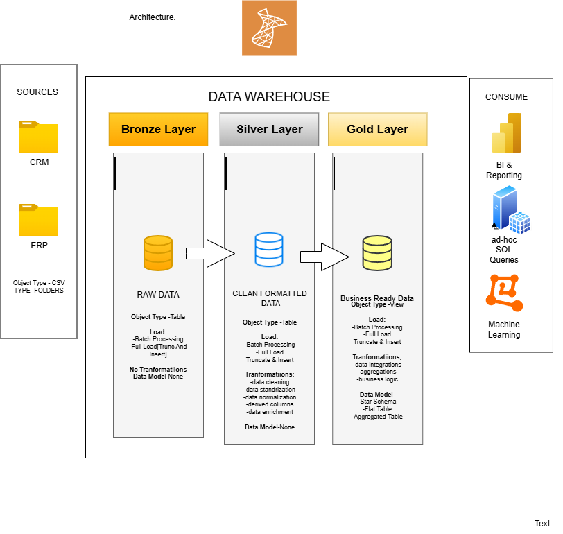

# Data Warehouse and Analytics Project

Welcome to the **Data Warehouse and Analytics Project** repository.

This project demonstrates a complete data warehousing and analytics solution built in Microsoft SQL Server, from ingesting raw source data through to generating actionable business insights. Built as a portfolio project, it follows industry best practices in data engineering, ETL pipeline development, data modeling, and SQL-based analytics.

This project was completed as part of my ongoing SQL and data engineering learning, inspired by [Data With Baraa's](https://www.youtube.com/@DataWithBaraa) SQL Data Warehouse course. All code, documentation, and analysis in this repository is my own implementation.

---

## Data Architecture



This project follows the **Medallion Architecture** with Bronze, Silver, and Gold layers:

1. **Bronze Layer:** Stores raw data as-is from the source systems. Data is ingested from CSV files into SQL Server.
2. **Silver Layer:** Includes data cleansing, standardization, and normalization processes to prepare data for analysis.
3. **Gold Layer:** Houses business-ready data modeled into a star schema for reporting and analytics.

---

## Project Overview

This project involves:

1. **Data Architecture:** Designing a modern data warehouse using the Medallion Architecture with Bronze, Silver, and Gold layers.
2. **ETL Pipelines:** Extracting, transforming, and loading data from source systems into the warehouse.
3. **Data Modeling:** Developing fact and dimension tables optimized for analytical queries.
4. **Analytics and Reporting:** Creating SQL-based reports and dashboards for actionable insights.

### Skills Demonstrated

- SQL Development
- Data Architecture
- Data Engineering
- ETL Pipeline Development
- Data Modeling
- Data Analytics

---

## Important Links and Tools

Everything used in this project is free:

- **[Datasets](datasets/):** Access the project datasets (CSV files)
- **[SQL Server Express](https://www.microsoft.com/en-us/sql-server/sql-server-downloads):** Lightweight server for hosting the SQL database
- **[SQL Server Management Studio (SSMS)](https://learn.microsoft.com/en-us/sql/ssms/download-sql-server-management-studio-ssms):** GUI for managing and interacting with databases
- **[Git Repository](https://github.com/rmorataya001):** Version control and collaboration
- **[DrawIO](https://www.drawio.com):** Design data architecture, models, flows, and diagrams
- **[Notion](https://app.notion.com/p/SQL-Data-Warehouse-Project-RM-94e52ab89e178254968a81f3d053a354?source=copy_link):** Access to All Project Phases and Tasks.
---

## Project Requirements

### Building the Data Warehouse (Data Engineering)

**Objective:**
Develop a modern data warehouse using SQL Server to consolidate sales data, enabling analytical reporting and informed decision making.

**Specifications:**
- **Data Sources:** Import data from two source systems (ERP and CRM) provided as CSV files
- **Data Quality:** Cleanse and resolve data quality issues prior to analysis
- **Integration:** Combine both sources into a single, user-friendly data model designed for analytical queries
- **Scope:** Focus on the latest dataset only; historization of data is not required
- **Documentation:** Provide clear documentation of the data model to support both business stakeholders and analytics teams

### BI: Analytics and Reporting (Data Analysis)

**Objective:**
Develop SQL-based analytics to deliver detailed insights into:

- **Customer Behavior**
- **Product Performance**
- **Sales Trends**

These insights empower stakeholders with key business metrics, enabling strategic decision making.

---

## Repository Structure

```
data-warehouse-project/
│
├── datasets/                # Raw datasets used for the project (ERP and CRM data)
│
├── docs/                    # Project documentation and architecture details
│   ├── etl.drawio           # Draw.io file showing ETL techniques and methods
│   ├── data_architecture.drawio  # Draw.io file showing the project architecture
│   ├── data_catalog.md      # Catalog of datasets, including field descriptions and metadata
│   ├── data_flow.drawio     # Draw.io file for the data flow diagram
│   ├── data_models.drawio   # Draw.io file for data models (star schema)
│   └── naming-conventions.md # Consistent naming guidelines for tables, columns, and files
│
├── scripts/                 # SQL scripts for ETL and transformations
│   ├── bronze/              # Scripts for extracting and loading raw data
│   ├── silver/              # Scripts for cleaning and transforming data
│   └── gold/                # Scripts for creating analytical models
│
├── tests/                   # Test scripts and quality files
│
├── README.md                # Project overview and instructions
├── LICENSE                  # License information for the repository
└── .gitignore               # Files and directories to be ignored by Git
```

---

## About Me

Hi, I am Rene Morataya Garcia. I am a data analyst, Marine Corps veteran, and recent graduate of Mercy University (B.S. in Business Administration, Data Analytics, Summa Cum Laude). I am currently pursuing an M.S. in Business Analytics and building my skills in SQL, Python, Power BI, and data engineering.

I built this project to demonstrate my ability to design and implement a full data warehouse from scratch, following the Medallion Architecture and industry best practices for ETL, data modeling, and analytics.

Connect with me:

- **[GitHub](https://github.com/rmorataya001)**
- **[LinkedIn](https://linkedin.com/in/rene-morataya-735855321)**
- **Email:** rmorataya001@gmail.com

---

## Acknowledgments

This project was built following the [Data With Baraa](https://www.youtube.com/@DataWithBaraa) SQL Data Warehouse course. The original course materials and project structure are credited to Baraa Khatib Salkini. This repository represents my own implementation and learning.

---

## License

This project is licensed under the MIT License. You are free to use, modify, and share this project with proper attribution.
